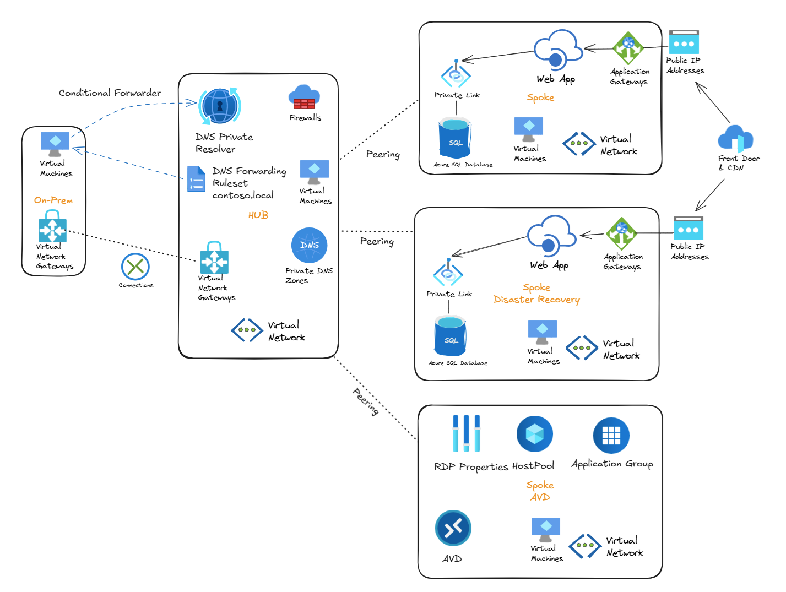

# Hub-Spoke Azure Demo - Terraform Infrastructure as Code

This repository provides Infrastructure as Code (IaC) scripts to deploy a complete hub-and-spoke network architecture on Azure using Terraform. The deployment includes simulated on-premises connectivity, Azure Virtual Desktop (AVD), Web Apps with SQL Database, Application Gateway, Azure Front Door, and comprehensive security features.



---

## 🚀 Quick Start

1. **Review** [Prerequisites](docs/PREREQUISITES.md) - Ensure you have required tools and permissions
2. **Read** [Project Overview](docs/OVERVIEW.md) - Understand the architecture and components
3. **Configure** [Usage Guide](docs/USAGE.md) - Set up your `terraform.tfvars` file
4. **Choose** [Use Case](docs/USECASES.md) - Select your deployment scenario
5. **Deploy** - Run `terraform apply`

```bash
# Quick deployment steps
az login
terraform init
terraform plan
terraform apply
```

---

## 📚 Documentation

| Document | Description |
|----------|-------------|
| **[Project Overview](docs/OVERVIEW.md)** | Architecture, features, and network topology |
| **[Prerequisites](docs/PREREQUISITES.md)** | Required tools, subscriptions, and permissions |
| **[Usage Guide](docs/USAGE.md)** | Configuration parameters and deployment steps |
| **[Use Cases](docs/USECASES.md)** | Deployment scenarios from minimal to full production |

---

## 🏗️ Architecture Overview

This Terraform configuration deploys a production-ready hub-and-spoke topology across multiple Azure subscriptions:

**Hub/Shared Services:**
- Virtual Network (10.0.0.0/16)
- Azure Firewall (optional)
- VPN Gateway (optional)
- DNS Private Resolver
- Azure Bastion

**Spoke Workloads:**
- Primary Spoke (10.10.0.0/16)
- DR Spoke (10.20.0.0/16)
- SQL Databases with Private Endpoints
- App Services
- Application Gateways
- Azure Front Door

**Optional Components:**
- Azure Virtual Desktop (10.30.0.0/16)
- On-Premises Simulation (10.200.0.0/16)
- Site-to-Site VPN

For detailed architecture information, see [Project Overview](docs/OVERVIEW.md).

---

## ⚙️ Configuration

### Subscription Architecture

This deployment follows the **Azure Landing Zone pattern** with separate subscriptions for different workload types:

| Subscription | Purpose | Resources Deployed |
|--------------|---------|-------------------|
| **Management** | Platform management (optional - not used in this demo) | Reserved for future management services |
| **Connectivity** | Network hub, shared services, and DNS | Hub VNet, VPN Gateway, Azure Firewall, Azure Bastion, On-Premises simulation, **DNS Private Resolver, Private DNS Zones, DNS Forwarding Ruleset** |
| **Landing Zone Corp** | Application workloads | Spoke VNets, SQL Databases, App Services, Application Gateways, Front Door, Storage Accounts |
| **Landing Zone AVD** | Virtual Desktop Infrastructure | AVD VNet, Host Pool, Session Hosts, Application Groups, Workspace |

> **📝 Note**: According to Azure Landing Zone best practices, all DNS resources (Private Resolver, Private DNS Zones, and Forwarding Rulesets) are deployed in the **Connectivity subscription** alongside the network hub.

#### Using Multiple Subscriptions (Recommended)
Multi-subscription design provides:
- **Cost segregation** - Track costs per workload type
- **Security isolation** - Separate RBAC and policies per subscription
- **Quota management** - Separate quotas for different workloads
- **Blast radius reduction** - Issues in one subscription don't affect others

#### Using a Single Subscription
If you only have **one subscription**, use the same subscription ID for all parameters:

```hcl
# Single subscription approach
ManagementSubscriptionID            = "xxxxxxxx-xxxx-xxxx-xxxx-xxxxxxxxxxxx"
connectivitySubscriptionID          = "xxxxxxxx-xxxx-xxxx-xxxx-xxxxxxxxxxxx"  # Same ID
landingzonecorpSubscriptionID       = "xxxxxxxx-xxxx-xxxx-xxxx-xxxxxxxxxxxx"  # Same ID
landingzoneavdSubscriptionID        = "xxxxxxxx-xxxx-xxxx-xxxx-xxxxxxxxxxxx"  # Same ID
```

All resources will be deployed to the same subscription, but still organized into separate resource groups for logical separation.

---

### Required Parameters

Create a `terraform.tfvars` file with your configuration:

```hcl
# Azure Subscription IDs
ManagementSubscriptionID            = "xxxxxxxx-xxxx-xxxx-xxxx-xxxxxxxxxxxx"
connectivitySubscriptionID          = "xxxxxxxx-xxxx-xxxx-xxxx-xxxxxxxxxxxx"
landingzonecorpSubscriptionID       = "xxxxxxxx-xxxx-xxxx-xxxx-xxxxxxxxxxxx"
landingzoneavdSubscriptionID        = "xxxxxxxx-xxxx-xxxx-xxxx-xxxxxxxxxxxx"

# Security Credentials
vpnsharedkey                        = "YourSecureKey123!"
vm_admin_password                   = "P@ssw0rd123!"
administrator_sql_login_password    = "SqlP@$$w0rd!"

# Feature Flags (control what gets deployed)
enableresource                      = true   # PaaS resources (SQL, App Service, etc.)
enablevms                           = true   # Virtual machines
avdenabled                          = false  # Azure Virtual Desktop
onpremises                          = false  # On-premises simulation and VPN
```

> **⚠️ Security Warning**: Never commit `terraform.tfvars` to source control!

For detailed parameter explanations, see [Usage Guide](docs/USAGE.md).

---

## 🎯 Deployment Scenarios

Choose a scenario based on your needs:

> **📊 Note**: Cost and time estimates below are **approximations only** and have not been measured in production. Actual costs and deployment times will vary based on Azure region, subscription type, discounts, resource usage patterns, and other factors. Use the [Azure Pricing Calculator](https://azure.microsoft.com/pricing/calculator/) for accurate cost estimates.

| Scenario | Use Case | Estimated Cost/Month | Estimated Time |
|----------|----------|----------------------|----------------|
| **Minimal** | Network testing | ~$50-100 | ~10-15 min |
| **Development** | App development | ~$200-350 | ~30-40 min |
| **AVD** | Virtual desktops | ~$300-500 | ~45-60 min |
| **Production** | Full app stack with DR | ~$500-800 | ~60-90 min |
| **Enterprise** | Everything enabled | ~$800-1200 | ~90-120 min |

See [Use Cases](docs/USECASES.md) for detailed scenario configurations.

---

## 🔐 Security Features

- **Private Endpoints** - All PaaS services accessible only via private IPs
- **Azure Firewall** - Centralized network security and traffic inspection
- **Network Security Groups** - Subnet-level traffic filtering
- **Azure Bastion** - Secure VM access without public IPs
- **Storage OAuth Authentication** - Azure AD-based storage access
- **SQL Authentication** - Both SQL and Entra ID authentication supported
- **Multi-Subscription Design** - Isolation following Azure Landing Zone pattern

---

## 📊 What Gets Deployed

The deployment is fully customizable via feature flags:

### Always Deployed (Base Infrastructure)
- Hub VNet with DNS Private Resolver
- Spoke VNets (Primary and DR)
- VNet Peerings
- Private DNS Zones
- Resource Groups

### Optional Components (via Feature Flags)

**`enableresource = true`:**
- Azure SQL Databases (Primary + DR)
- App Services (Primary + DR)
- Application Gateways (Primary + DR)
- Azure Front Door
- Azure Firewall
- Storage Accounts
- Private Endpoints

**`enablevms = true`:**
- Test VMs in Hub and Spokes
- Azure Bastion hosts

**`avdenabled = true`:**
- AVD Host Pool
- Session Host VMs (Windows 11)
- Application Group
- AVD Workspace

**`onpremises = true`:**
- On-premises VNet simulation
- VPN Gateways (Hub and On-premises)
- Site-to-Site VPN Connection
- DNS Server VM

---

## 🧪 Testing & Validation

### DNS Resolution
```powershell
# Test private endpoint DNS (from VM via Bastion)
nslookup test-sql-server-01-XXXX.database.windows.net
# Expected: 10.10.x.x (private IP)
```

### SQL Database
```bash
# SQL Server supports both authentication methods:
# 1. SQL Authentication: sqladmin / <administrator_sql_login_password>
# 2. Entra ID Authentication: Current Azure AD user

# Test from VM
sqlcmd -S test-sql-server-01-XXXX.database.windows.net -U sqladmin -P <password>
```

### Application Gateway
```bash
# Get Application Gateway public IP
az network public-ip show --resource-group rg-spoke --name app-gateway-ip --query ipAddress

# Test connectivity
curl http://<app-gateway-ip>
```

### Azure Virtual Desktop
```
# Access AVD
https://client.wvd.microsoft.com/
# Sign in with Azure AD credentials
```

For comprehensive testing procedures, see [Use Cases](docs/USECASES.md).

---

## �️ Troubleshooting

### Common Issues

**VPN Gateway Timeout:**
- VPN Gateways take 30-45 minutes to deploy
- This is normal Azure behavior

**SQL Authentication:**
- SQL Servers are configured with **both SQL and Entra ID authentication**
- Use `sqladmin` with `administrator_sql_login_password` for SQL auth
- Or use Azure AD authentication with current user

**Resource Provider Not Registered:**
```bash
az provider register --namespace Microsoft.Network
az provider register --namespace Microsoft.Sql
az provider register --namespace Microsoft.Web
az provider register --namespace Microsoft.DesktopVirtualization
```

For detailed troubleshooting, see [Usage Guide](docs/USAGE.md).

---

## 💰 Cost Estimates

> **⚠️ Important**: These are **rough estimates only** and have **not been measured in actual deployments**. Costs vary significantly based on region, usage patterns, VM uptime, data transfer, and Azure discounts.

| Configuration | Estimated Monthly Cost |
|--------------|------------------------|
| Network only (minimal) | ~$50-100 |
| Development environment | ~$200-350 |
| AVD deployment | ~$300-500 |
| Production with DR | ~$500-800 |
| Full enterprise deployment | ~$800-1200 |

**Cost optimization tips:**
- Use `enableresource = false` to skip expensive PaaS services
- Use `onpremises = false` to skip VPN Gateways (~$280/month)
- Stop VMs when not in use
- Use Basic SKUs for SQL and App Service in dev/test

**For accurate pricing**: Use the [Azure Pricing Calculator](https://azure.microsoft.com/pricing/calculator/)

---

## 🔄 Making Changes

### Enable or Disable Features

Edit `terraform.tfvars` and change feature flags:

```hcl
# Enable AVD
avdenabled = true
```

Apply changes:
```bash
terraform plan   # Review changes
terraform apply  # Apply changes
```

### Destroy Resources

```bash
# Destroy all resources
terraform destroy

# Or disable via feature flags
avdenabled = false  # This will destroy AVD resources
terraform apply
```

---

## 📝 Customization

### Modify Network Addressing
Edit `main.tf` locals block:
```hcl
locals {
  spoke_vnet_address_space = ["10.10.0.0/16"]  # Change IP range
  # ... other network settings
}
```

### Change Deployment Regions
```hcl
locals {
  corelocation     = "uksouth"  # Primary region
  spokedr_location = "ukwest"   # DR region
}
```

### Adjust AVD Capacity
```hcl
locals {
  avd-vm-size  = "Standard_D2s_v3"  # Session host size
  avd-vm-count = 2                   # Number of session hosts
}
```

---

## 🔒 Security Best Practices

1. **Never commit `terraform.tfvars`** - Add to `.gitignore`
2. **Use strong passwords** - Meet Azure complexity requirements
3. **Use Azure Key Vault** - Store secrets in Key Vault for production
4. **Rotate credentials regularly** - Change passwords and keys periodically
5. **Apply least privilege** - Review NSG rules and RBAC assignments
6. **Enable logging** - Configure diagnostic settings for all resources

---

## 📚 Additional Resources

- [Terraform Azure Provider Documentation](https://registry.terraform.io/providers/hashicorp/azurerm/latest/docs)
- [Azure Hub-Spoke Architecture](https://learn.microsoft.com/en-us/azure/architecture/reference-architectures/hybrid-networking/hub-spoke)
- [Azure Virtual Desktop Documentation](https://learn.microsoft.com/en-us/azure/virtual-desktop/)
- [Azure Landing Zones](https://learn.microsoft.com/en-us/azure/cloud-adoption-framework/ready/landing-zone/)

---

## 📄 License

This project is provided as-is for demonstration and learning purposes.

---

## 🤝 Contributing

Contributions, issues, and feature requests are welcome! Please ensure you:
- Follow existing code style
- Test changes thoroughly
- Update documentation as needed
- Don't commit sensitive information

---

## 📧 Support

For questions or issues:
1. Review the [documentation](docs/)
2. Check existing issues in the repository
3. Open a new issue with detailed information
