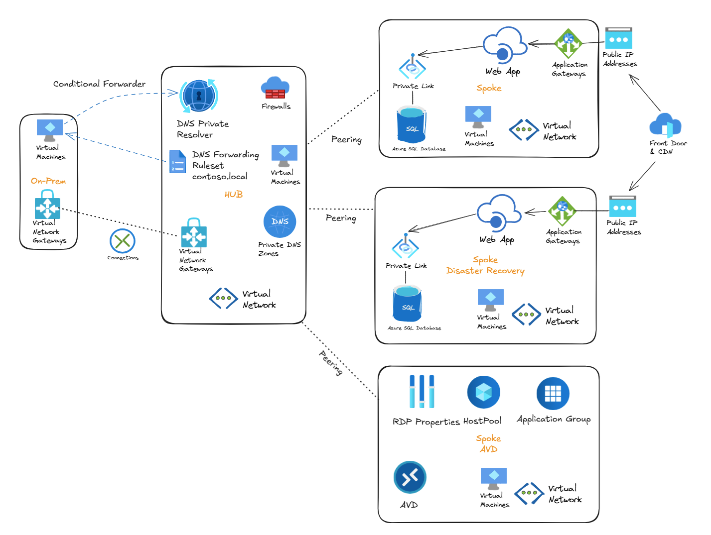

# Hub-Spoke Azure Demo - Project Overview

## Introduction

This repository provides Infrastructure as Code (IaC) scripts using Terraform to deploy a complete hub-and-spoke network architecture on Azure. The deployment showcases a production-ready enterprise architecture pattern with simulated on-premises connectivity, Azure Virtual Desktop (AVD), Web Applications with SQL Database, Application Gateway, Azure Front Door, and comprehensive security features.



---

## 🏗️ Architecture Overview

This Terraform configuration deploys a production-ready hub-and-spoke topology across multiple Azure subscriptions with the following components:

### Shared/Hub Resource Group (Connectivity Subscription)
The central connectivity hub that provides shared services and network transit:

- **Virtual Network (Hub)** - Central connectivity point (10.0.0.0/16)
- **Azure Firewall** - Network security and traffic inspection
- **VPN Gateway** - Hybrid connectivity to on-premises environments
- **DNS Private Resolver** - Hybrid DNS resolution with inbound and outbound endpoints
- **Windows VM** - Management and testing purposes
- **Azure Bastion (Standard)** - Secure VM access without public IPs

### DNS Resource Group (Management Subscription)
Centralized DNS management for the entire architecture:

- **DNS Private Resolver** - Inbound and outbound DNS endpoints
- **Private DNS Zones** - All Azure privatelink zones for Private Endpoints
  - `privatelink.database.windows.net`
  - `privatelink.blob.core.windows.net`
  - `privatelink.file.core.windows.net`
  - `privatelink.queue.core.windows.net`
  - `privatelink.table.core.windows.net`
  - `privatelink.azurewebsites.net`
- **DNS Forwarding Ruleset** - Conditional forwarding to on-premises DNS servers

### On-Premises Resource Group (Optional)
Simulates an on-premises datacenter environment:

- **Virtual Network** - Simulates on-premises network (10.200.0.0/16)
- **VPN Gateway** - Site-to-site VPN connection to Azure hub
- **Windows DNS Server VM** - Custom DNS with contoso.local zone
- **Azure Bastion** - Secure access to on-premises simulation

### Spoke Resource Group - Primary (Landing Zone Corp Subscription)
Primary application workload environment:

- **Virtual Network** - Workload isolation (10.10.0.0/16)
- **App Service** - Web application hosting
- **Azure SQL Database** - Backend database with SQL and Entra ID authentication
- **Private Endpoints** - Secure connectivity for SQL and Storage
- **Application Gateway** - Regional load balancer with WAF
- **Storage Account** - Application data storage
- **Windows VM** - Testing and management

### Spoke DR Resource Group - Disaster Recovery (Landing Zone Corp Subscription)
Secondary region for business continuity:

- **Virtual Network (DR Region)** - Secondary region deployment (10.20.0.0/16)
- **App Service (DR)** - Failover web application
- **Azure SQL Database (DR)** - Geo-replicated backend database
- **Private Endpoints (DR)** - Secure connectivity in DR region
- **Application Gateway (DR)** - Regional load balancer in DR region
- **Storage Account (DR)** - Replicated storage
- **Windows VM (DR)** - Testing and management in DR region

### Azure Front Door (Landing Zone Corp Subscription)
Global traffic management:

- **Front Door Profile** - Global load balancer
- **Origin Groups** - Primary and DR backends
- **Endpoints** - Public-facing HTTPS endpoints
- **Routes** - Traffic routing rules

### AVD Resource Group (Optional - AVD Subscription)
Azure Virtual Desktop deployment for remote desktop services:

- **Virtual Network** - Isolated AVD deployment (10.30.0.0/16)
- **Host Pool** - AVD session host management
- **Session Hosts** - Windows 11 Enterprise VMs (Entra ID joined)
- **Application Group** - Desktop session publishing
- **Workspace** - User access portal

---

## 🎯 Key Features

### Network Architecture
- **Hub-Spoke Topology** - Centralized connectivity and shared services
- **VNet Peering** - High-performance connectivity between VNets
- **Gateway Transit** - Centralized VPN/ExpressRoute connectivity
- **Multi-Subscription Support** - Enterprise-ready subscription design
- **Network Segmentation** - Isolation between workloads

### Security
- **Private Endpoints** - All PaaS services accessible only via private IPs
- **Azure Firewall** - Centralized network security and traffic inspection
- **Network Security Groups** - Subnet-level traffic filtering
- **Azure Bastion** - Secure VM access without public IPs or VPN
- **Storage OAuth Authentication** - Azure AD-based storage access
- **SQL Authentication** - Both SQL and Entra ID authentication supported

### High Availability & Disaster Recovery
- **Multi-Region Deployment** - Primary and DR regions
- **Azure Front Door** - Global load balancing and failover
- **Geo-Replicated Databases** - SQL Database geo-replication
- **Redundant Storage** - Geo-redundant storage accounts
- **Application Gateways** - Regional load balancing in each region

### Hybrid Connectivity
- **VPN Gateway** - Site-to-site VPN connectivity
- **DNS Integration** - Hybrid DNS with conditional forwarding
- **On-Premises Simulation** - Built-in testing environment

### Flexible Deployment
- **Feature Flags** - Control what gets deployed via variables
- **Conditional Resources** - Deploy only what you need
- **Cost Optimization** - Scale from minimal to full production

---

## 🌐 Network Topology

```
┌─────────────────────────────────────────────────────────────┐
│                    Azure Front Door                          │
│              (Global Load Balancer)                          │
└──────────────────┬────────────────┬─────────────────────────┘
                   │                │
        ┌──────────▼──────┐  ┌─────▼──────────┐
        │  App Gateway    │  │ App Gateway DR │
        │   (UK South)    │  │   (UK West)    │
        └────────┬────────┘  └────────┬───────┘
                 │                    │
    ┌────────────▼──────┐  ┌─────────▼────────┐
    │   Spoke VNet      │  │  Spoke DR VNet   │
    │  (10.10.0.0/16)   │  │  (10.20.0.0/16)  │
    │  - App Service    │  │  - App Service   │
    │  - SQL Database   │  │  - SQL Database  │
    │  - Storage        │  │  - Storage       │
    │  - VM             │  │  - VM            │
    └─────────┬─────────┘  └──────────┬───────┘
              │                       │
              │   ┌───────────────┐   │
              └───►   Hub VNet    ◄───┘
                  │ (10.0.0.0/16) │
                  │ - Firewall    │
                  │ - VPN Gateway │
                  │ - DNS Resolver│
                  │ - Bastion     │
                  └───────┬───────┘
                          │
              ┌───────────┼──────────┐
              │           │          │
    ┌─────────▼─────┐  ┌──▼─────────▼──────┐
    │  AVD VNet     │  │ On-Premises VNet  │
    │(10.30.0.0/16) │  │ (10.200.0.0/16)   │
    │- Host Pool    │  │ - DNS Server      │
    │- Session Hosts│  │ - VPN Gateway     │
    └───────────────┘  └───────────────────┘
```

---

## 📦 Subscription Design

This architecture follows the Azure Landing Zone pattern with multiple subscriptions:

| Subscription | Purpose | Resources |
|-------------|---------|-----------|
| **Management** | Platform management services | DNS Private Resolver, Private DNS Zones, DNS Forwarding Ruleset |
| **Connectivity** | Network hub and shared services | Hub VNet, Azure Firewall, VPN Gateway, Bastion, On-Premises Simulation |
| **Landing Zone Corp** | Production workloads | Spoke VNets, App Services, SQL Databases, Application Gateways, Front Door |
| **Landing Zone AVD** | Virtual Desktop Infrastructure | AVD VNet, Host Pool, Session Hosts, Workspace |

---

## 🔧 Technology Stack

- **Infrastructure as Code**: Terraform >= 1.8
- **Cloud Provider**: Microsoft Azure
- **Terraform Provider**: AzureRM ~> 4.0
- **Compute**: Azure Virtual Machines (Windows Server 2016/2022, Windows 11)
- **Networking**: VNet, VPN Gateway, Azure Firewall, Private Endpoints
- **PaaS Services**: App Service, SQL Database, Storage Accounts
- **Load Balancing**: Application Gateway, Azure Front Door
- **Security**: Azure Bastion, Network Security Groups, Private DNS
- **Remote Desktop**: Azure Virtual Desktop

---

## 📊 Cost Considerations

Costs vary significantly based on which features are enabled:

| Component | Approximate Monthly Cost |
|-----------|-------------------------|
| Hub VNet + Subnets | $0 (VNets are free) |
| VPN Gateway | $140-280 (depends on SKU) |
| Azure Firewall | $800+ |
| DNS Private Resolver | $55 |
| Azure Bastion (Standard) | $140 |
| Application Gateway | $250-400 per instance |
| Azure Front Door | $35 + usage |
| SQL Database (Basic) | $5-15 per database |
| App Service (Basic) | $13-55 per plan |
| Virtual Machines (B2ms) | $60-80 per VM |
| AVD Session Hosts (D2s_v3) | $130-180 per VM |

**Total Cost Range:**
- Minimal (network only): $50-100/month
- Development: $200-350/month
- Production with DR: $500-800/month
- Full deployment with AVD: $800-1200/month

---

## 🎓 Learning Objectives

This demo helps you understand:

1. **Hub-Spoke Network Architecture** - Enterprise network topology patterns
2. **Multi-Subscription Management** - Azure Landing Zones pattern
3. **Hybrid Connectivity** - VPN site-to-site and DNS integration
4. **Private Endpoints** - Secure PaaS service connectivity
5. **Infrastructure as Code** - Terraform best practices
6. **Disaster Recovery** - Multi-region deployment strategies
7. **Azure Virtual Desktop** - Modern virtual desktop infrastructure
8. **Global Load Balancing** - Azure Front Door implementation

---

## 📄 License

This project is provided as-is for demonstration and learning purposes.

---

## 🤝 Contributing

Contributions, issues, and feature requests are welcome!
